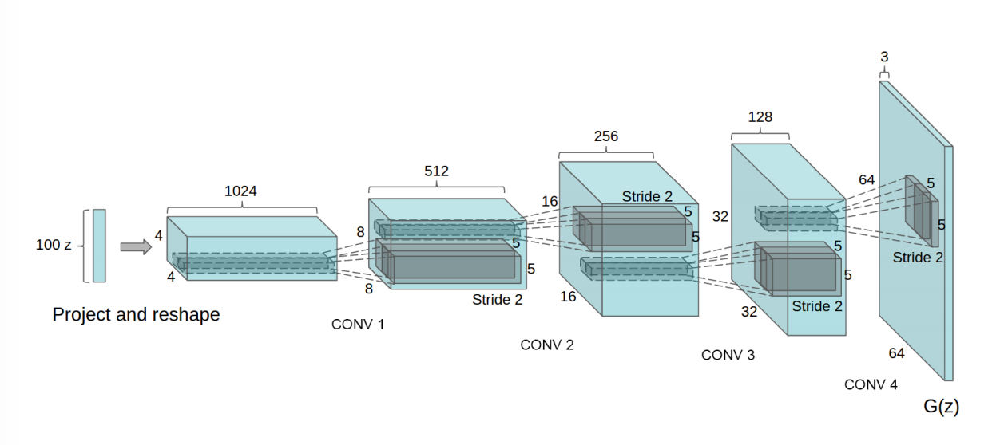

# Deep Convolutional Generative Adversarial Network

PyTorch implementation of DCGAN introduced in the paper: [Unsupervised Representation Learning with Deep Convolutional 
Generative Adversarial Networks](https://arxiv.org/abs/1511.06434), Alec Radford, Luke Metz, Soumith Chintala.

<p align="center">

</p>

**Generator Architecture**
<p align="center">

</p>

**Network Design of DCGAN:**
* Replace all pooling layers with strided convolutions.
* Remove all fully connected layers.
* Use transposed convolutions for upsampling.
* Use Batch Normalization after every layer except after the output layer of the generator and the input layer of the discriminator.
* Use ReLU non-linearity for each layer in the generator except for output layer use tanh.
* Use Leaky-ReLU non-linearity for each layer of the disciminator excpet for output layer use sigmoid.

## Hyperparameters for this Implementation
Hyperparameters are chosen as given in the paper.
* mini-batch size: 128
* learning rate: 0.0002
* momentum term beta1: 0.5
* slope of leak of LeakyReLU: 0.2
* For the optimizer Adam (with beta2 = 0.999) has been used instead of SGD as described in the paper.

## Training
To train the model, run **`dcgan.py`**. To set the training parametrs, update the values in the `params` dictionary in `train.py`.
Checkpoints would be saved by default in model directory every 2 epochs. 
By default, GPU is used for training if available.

*Training will take a long time. It took me around 3 hours on a NVIDIA GeForce GTX 1060 GPU. Using a CPU is not recommended.*
```
Usage: dcgan.py [-h] --dataset DATASET --dataroot DATAROOT [--workers WORKERS]
               [--batchSize BATCHSIZE] [--imageSize IMAGESIZE] [--nz NZ]
               [--ngf NGF] [--ndf NDF] [--niter NITER] [--lr LR]
               [--beta1 BETA1] [--cuda] [--ngpu NGPU] [--netG NETG]
               [--netD NETD]

optional arguments:
  -h, --help            show this help message and exit
  --dataset DATASET     cifar10 | lsun | mnist |imagenet | folder | lfw | fake
  --dataroot DATAROOT   path to dataset
  --workers WORKERS     number of data loading workers
  --batchSize BATCHSIZE input batch size
  --imageSize IMAGESIZE the height / width of the input image to network
  --nz NZ               size of the latent z vector
  --ngf NGF
  --ndf NDF
  --niter NITER         number of epochs to train for
  --lr LR               learning rate, default=0.0002
  --beta1 BETA1         beta1 for adam. default=0.5
  --cuda                enables cuda
  --ngpu NGPU           number of GPUs to use
  --netG NETG           path to netG (to continue training)
  --netD NETD           path to netD (to continue training)
  --outf OUTF           folder to output images and model checkpoints
  --manualSeed SEED     manual seed
  --classes CLASSES     comma separated list of classes for the lsun data set
```

## Generating New Images
To generate new unseen images, run **`generate.py`**.
```sh
python3 generate.py --load_path /path/to/pth/checkpoint --num_output n
```

## References
1. **Alec Radford, Luke Metz, Soumith Chintala.** *Unsupervised representation learning with deep convolutional 
generative adversarial networks.*[[arxiv](https://arxiv.org/abs/1511.06434)]
2. **Ian Goodfellow, Jean Pouget-Abadie, Mehdi Mirza, Bing Xu, David Warde-Farley, 
Sherjil Ozair, Aaron Courville, Yoshua Bengio.** *Generative adversarial nets.* NIPS 2014 [[arxiv](https://arxiv.org/abs/1406.2661)]
3. **Ian Goodfellow.** *Tutorial: Generative Adversarial Networks.* NIPS 2016 [[arxiv](https://arxiv.org/abs/1701.00160)]
4. DCGAN Tutorial. [https://pytorch.org/tutorials/beginner/dcgan_faces_tutorial.html]
5. PyTorch Docs. [https://pytorch.org/docs/stable/index.html]
6. PyTorch Examples Github Repository [https://github.com/pytorch/examples]
